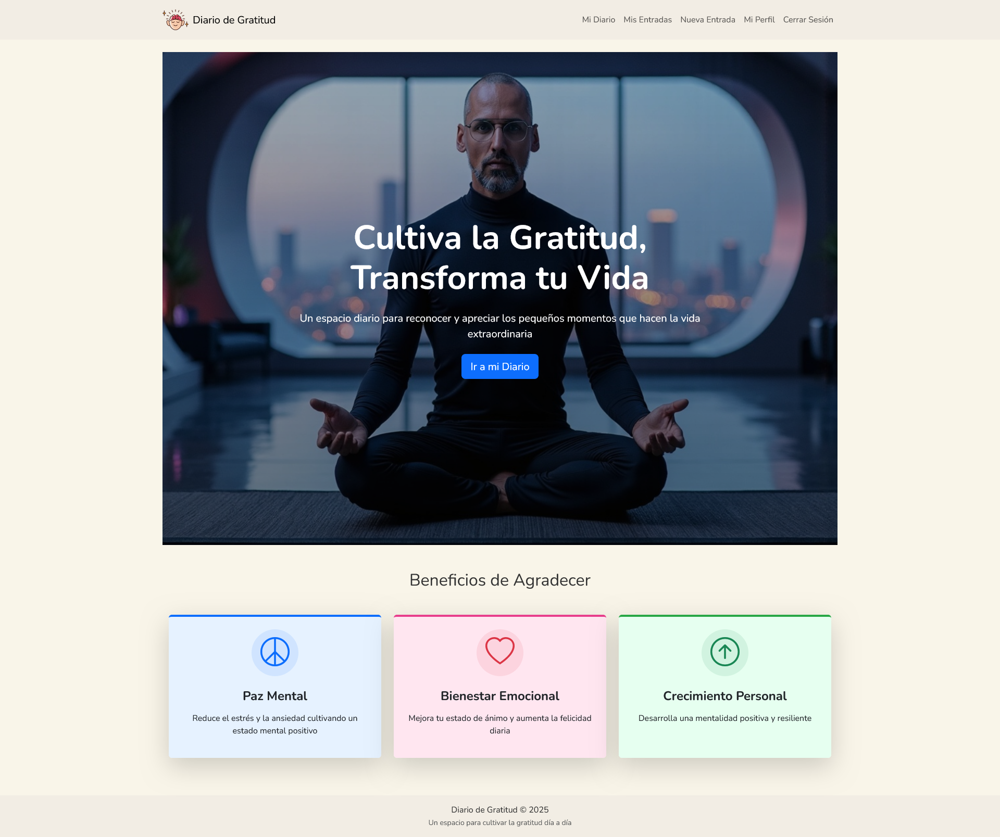
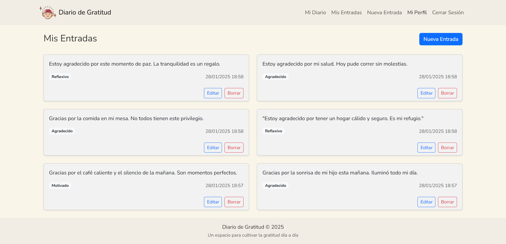
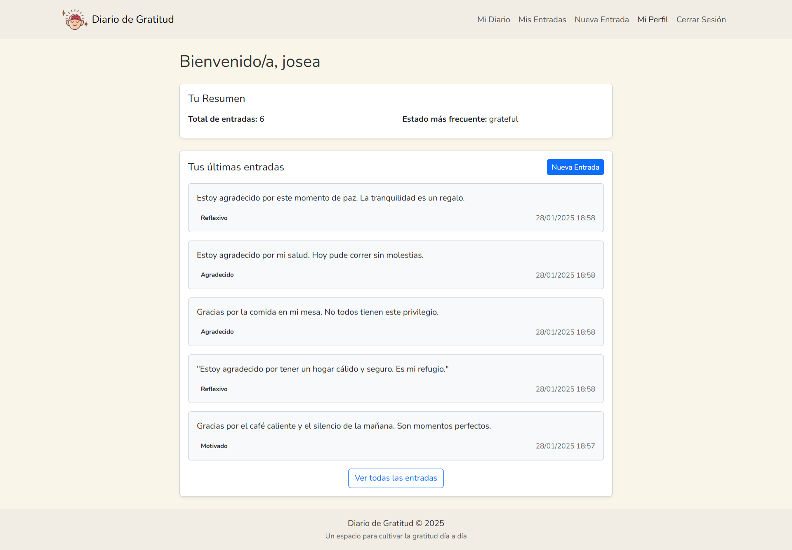

# Diario de Gratitud 📝

Una aplicación web desarrollada con Django que permite a los usuarios mantener un diario personal de gratitud, ayudándoles a enfocarse en los aspectos positivos de su vida diaria.

## Características principales 🌟

- **Gestión de entradas**
  - Crear, editar y eliminar entradas.
  - Registro del estado de ánimo.
  - Organización cronológica.

- **Sistema de Rachas** 🔥
  - Seguimiento de días consecutivos escribiendo.
  - Registro de mejor racha histórica.
  - Motivación para mantener el hábito diario.

- **Sistema de Logros** 🏆
  - Logros desbloqueables por constancia:
    - Semana Constante (7 días)
    - Mes Dedicado (30 días)
    - Trimestre de Gratitud (90 días)
    - Medio Año de Reflexión (180 días)
    - Maestro de la Gratitud (365 días)
  - Barra de progreso visual que muestra:
    - Porcentaje completado hacia el siguiente logro
    - Días restantes para alcanzar el objetivo
    - Actualización automática del progreso diario

- **Interfaz intuitiva**
  - Diseño responsive con Bootstrap.
  - Navegación sencilla.
  - Experiencia de usuario fluida.

- **Seguridad**
  - Sistema de autenticación de usuarios.
  - Protección de datos personales.
  - Entradas privadas por usuario.

## Tecnologías utilizadas 🛠️

- Django 5.0
- Bootstrap 5
- MySQL
- HTMX 
- Python 3.10+

## Estructura del proyecto 💃

```
gratitude_journal/
├── apps/
│   ├── gratitude_journal/  # Aplicación principal
│   └── users/              # Gestión de usuarios
├── media/                  # Archivos subidos
├── static/                 # Archivos estáticos
├── staticfiles/            # Archivos estáticos recolectados
├── templates/              # Plantillas HTML
├── venv/                   # Entorno virtual
├── .env                    # Variables de entorno
├── .gitignore
├── manage.py
└── requirements.txt
```

## Instalación local 💻

Sigue estos pasos para instalar y ejecutar la aplicación en tu entorno local.

```bash
# Clonar el repositorio
git clone https://github.com/tu-usuario/diario-gratitud.git

# Crear y activar entorno virtual
python -m venv venv
source venv/bin/activate  # Linux/Mac
venv\Scripts\activate    # Windows

# Instalar dependencias
pip install -r requirements.txt

# Configurar base de datos MySQL
# Crear base de datos y configurar settings.py con las credenciales

# Realizar migraciones
python manage.py migrate

# Iniciar servidor
python manage.py runserver
```

## Capturas de pantalla 📸

### Página de Inicio


### Mis Entradas


### Dashboard
